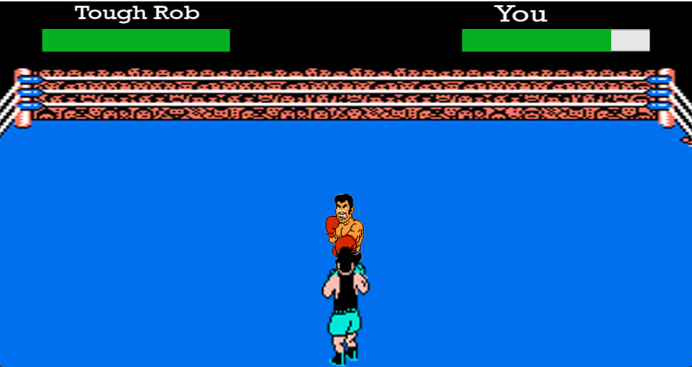
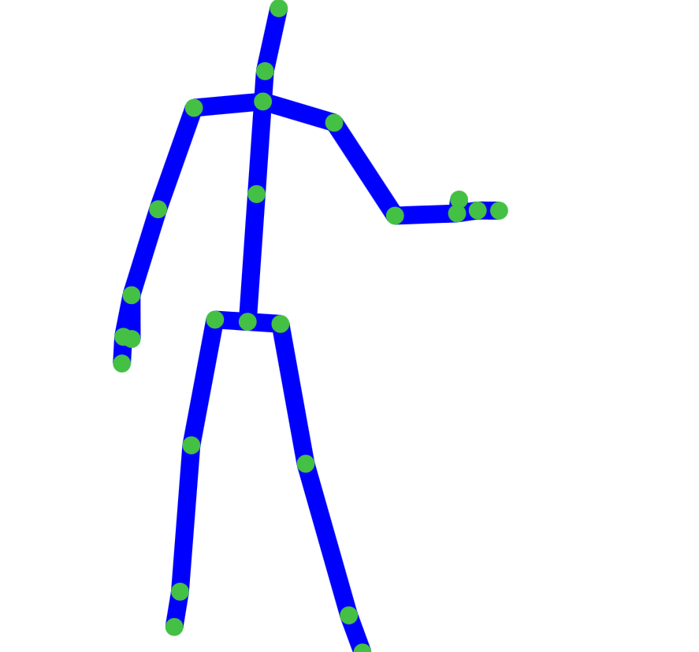
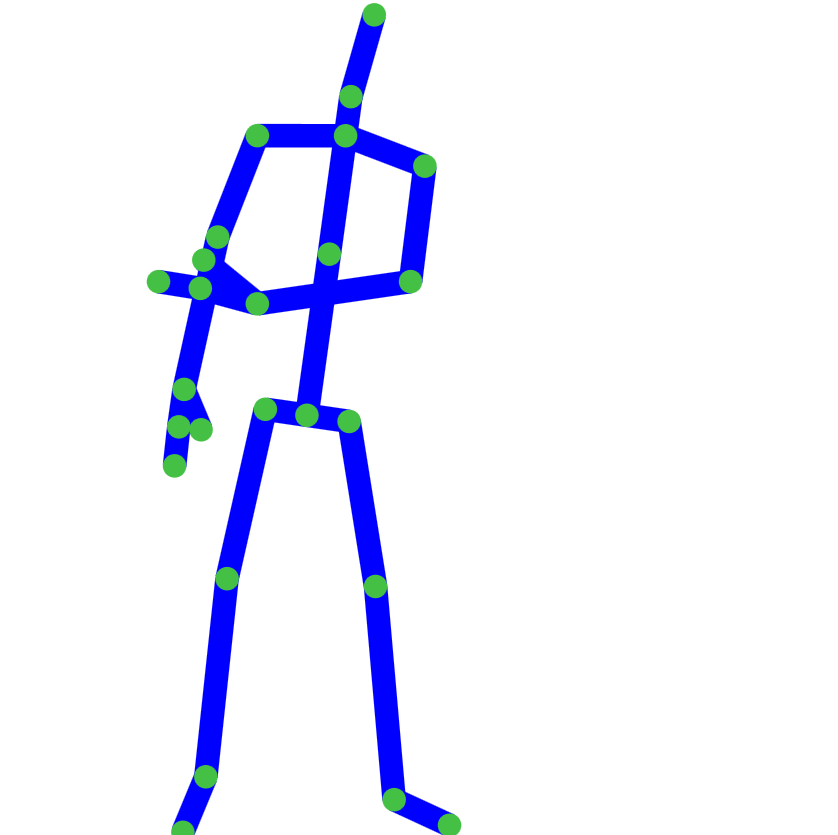
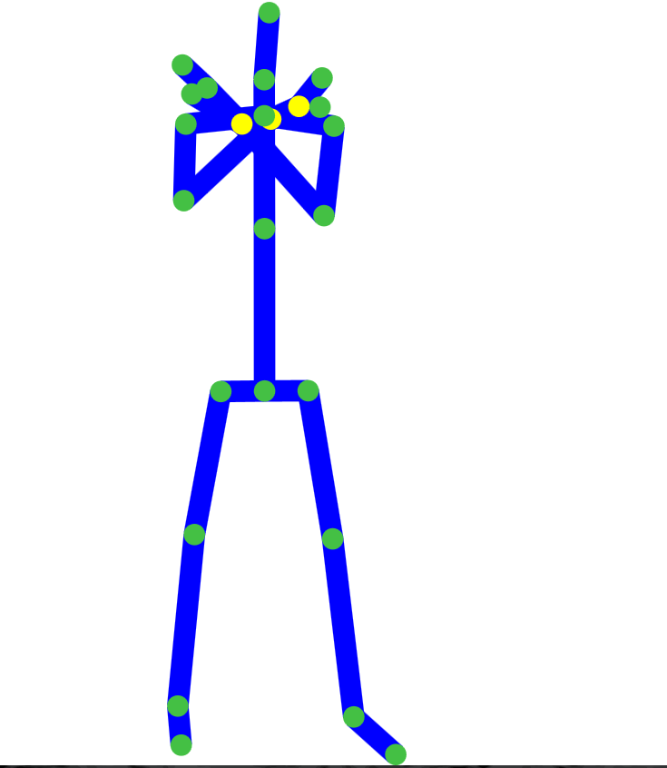
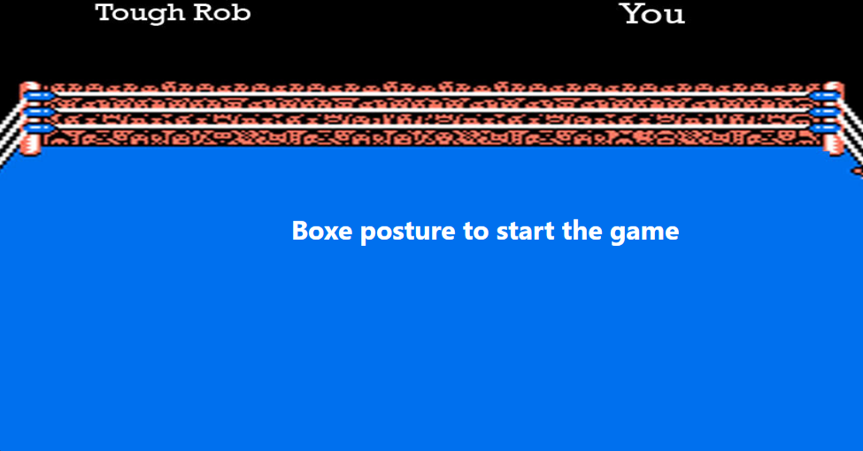
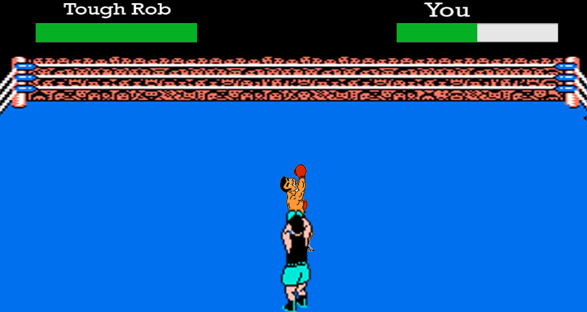
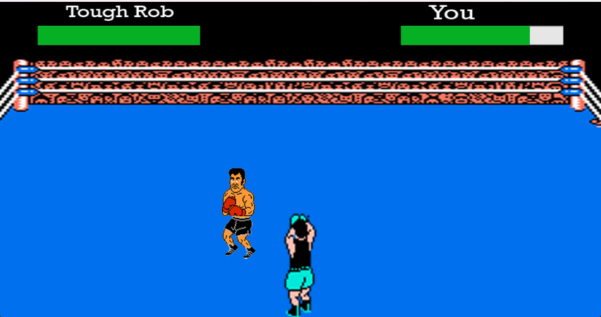
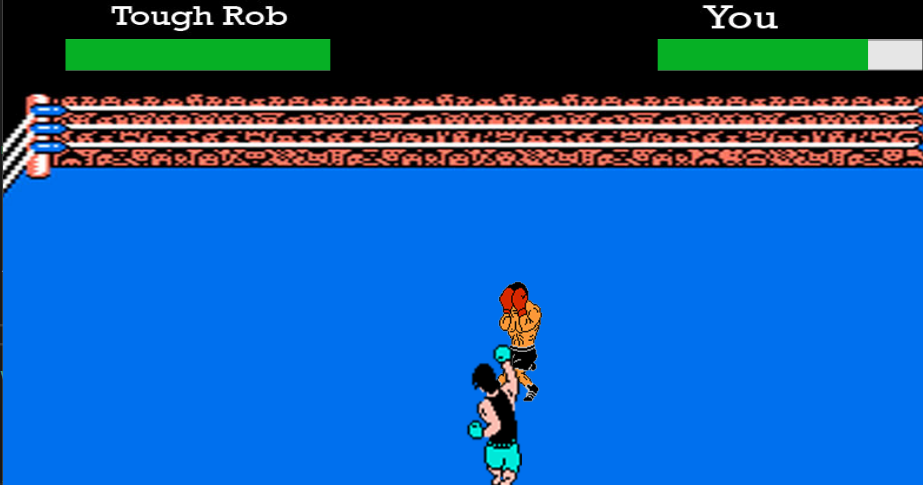

# Punchers 🥊

*******

Sommaire 
 1. [Présentation du projet](#presentation)
 2. [Fonctionnalités](#fonctionnalites)
 2. [Instructions](#instructions)
 3. [Explication des solutions](#solutions)
 4. [Auteurs](#auteurs)

*******

## Branch 🚨

La branch a été noté pour l'ensemble des TP est la branch `master`

*******

## Présentation du projet 🎉

 

**Punchers** est un jeu interactif qui utilise une Kinect, ce jeu permet aux joueurs de se lancer dans des combats palpitants en utilisant leurs propres mouvements de boxe.

*******

## Fonctionnalités

 

- **Combat en temps réel** : Affrontez un adversaire virtuel en utilisant vos mouvements de boxe.
- **Utilisation du Kinect** : La technologie Kinect détecte vos mouvements et les intègre dans le jeu pour une expérience immersive.
- **Gestion de la vie** : Surveillez votre barre de vie pour éviter d'être mis K.O. par votre adversaire.
- **Animation** : Des animations reproduisent vos mouvements de boxe à l'écran.

*******

## Instructions 📃

 

1. **Démarrez le jeu** en exécutant l'application, c'est à dire le projet "Punchers". Verifiez bien que votre Kinect est connecté.
2. **Positionnez-vous** devant le capteur Kinect pour que vos mouvements soient détectés.
3. **Adoptez** la posture de boxe pour commencer le jeu.
4. Utilisez vos mouvements de bras pour attaquer l'adversaire ou bloquer son attaque.
5. Surveillez votre barre de vie pour éviter d'être vaincu.
6. Suivez les instructions à l'écran pour continuer à jouer ou recommencer.

**Geste pour attaquer** ("SwitchHandRight"). Avec votre main droite vous allez faire un geste vers votre gauche :

Voici l'exemple :

↓

**Posture pour bloquer** ("BlocPosture"). Vous allez faire une croix avec vos deux bras.

Voici l'exemple :

*******

## Explication des solutions

 

En ce qui concerne la structure de notre projet, nous avons plusieurs projet dans notre solution `Kinect_TP`, nous allons les décrire ici : 

- `GestureTester` : Il s'agit d'une application console permettant de tester les gestes et postures à l'aide de la Kinect. Cette application affiche les gestes ou postures activés dans la console, fournissant ainsi un moyen de vérifier le bon fonctionnement des gestes et postures.

- `Kinect_Gesture` : Cette bibliothèque regroupe la logique nécessaire au fonctionnement des gestes, des postures et du mapping avec la Kinect. Elle fournit les fonctionnalités essentielles pour détecter et interpréter les gestes et postures des utilisateurs.

- `Kinect_TP` : une application WPF .NET Framework qui, lorsqu'elle est lancée, affiche une page qui permet de montrer les différentes réalisations du TP1. Avec le body stream, color stream, ect... Ce projet fonctionne en MVVM, avec une seule VM applicative pour la seule page du projet. 

- `Kinect_Utils` : une bibliothèque de classes qui rassemble la logique de l'utilisation de la kinect pour l'affichange de différents streams. Elle fournit des fonctionnalités utilitaires pour faciliter la manipulation de ces fluxs de données Kinect.

- `MyGestureBank` : une bibliothèque de classes qui contient toutes les postures et gestures codées et aussi les fabriques(factories) qui sont présentes également ici.

*******

## Auteurs 🙋‍♂️

 

BUT Informatique - Clermont Ferrand - 2023-2024
Étudiants 3ème année - Filière Mobile PM2:
   
`DA COSTA CUNHA Bruno` et `SAOULA Zakariya`

*******

## Captures d'écran concernant le jeu :

