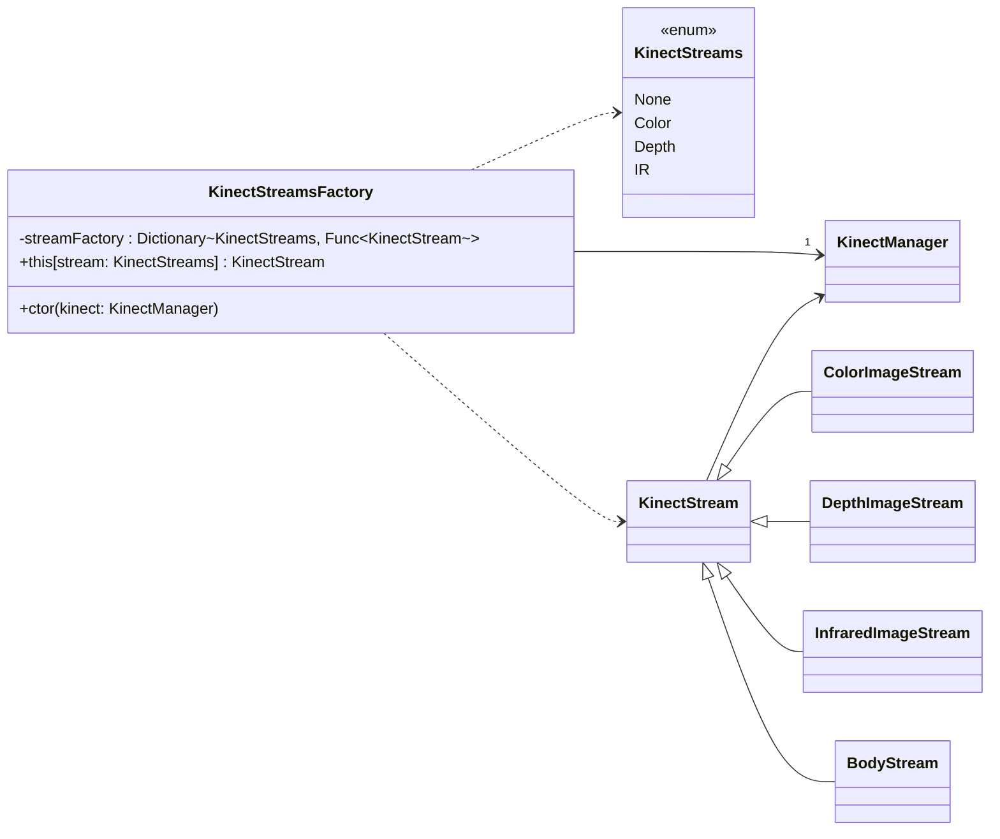

# Virtual Reality - TP1

## Architecture

## Fonctionnalities ✅

- WPF Window
- MVVM Architecture and set-up
- ColorImageStream has been done
- BodyStream has been done
- InfraredImageStream has been done ?
- DepthImageStream has been done ?

## Difficulties and not done ❌

- The Command Button didn't work 
- No UT, but fonctionnal tests
- No "Display Body and Color Streams in the meantime"

